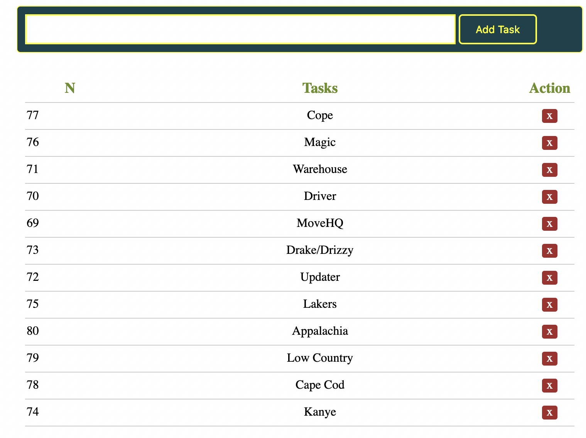

# rawPHP

simply showcasing what I can do with rawPHP in less than ~2 hours :: simple and crude PHP ToDo App




## Running App
```sh
cd 
composer install
php -S localhost:8000
```

## Running Tests
```sh
cd test
php test-basic.php

#if CLI tool is installed
phpunit --all
```